# 🍎 Yablochny Preset + Extension

Расширение и пресет для **SillyTavern**. Позволяет управлять стилем, логикой и сюжетом через удобные переключатели.

---

## 🛠 Установка и Обновление

### 1. Установка расширения
1. Откройте SillyTavern -> **Extensions**.
2. Нажмите **Install Extension** и вставьте ссылку на этот репозиторий.
3. Нажмите **Install**.
4. **Обязательно перезагрузите страницу (F5)**.

  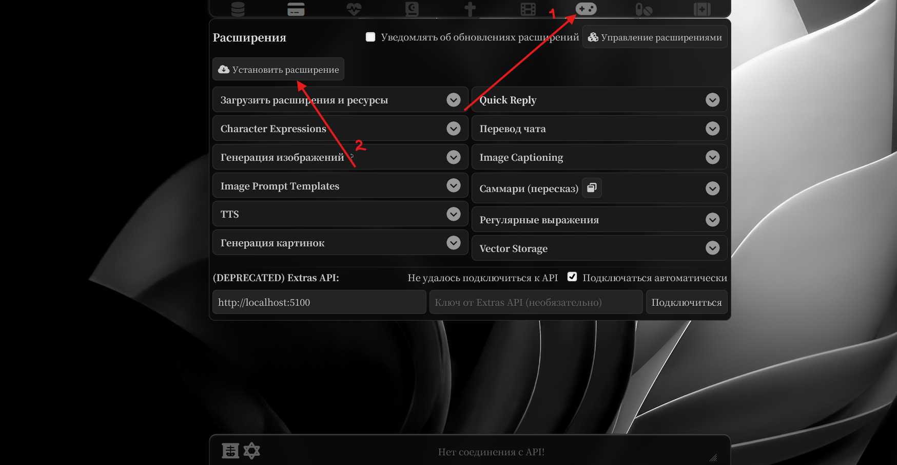
  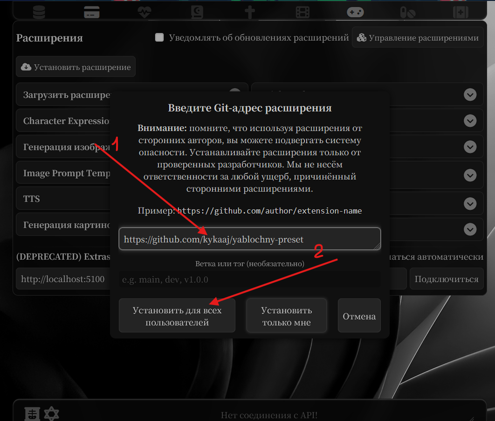

### 2. Обновление пресета
1. Зайдите в меню **AI Response Configuration** (обычная вкладка пресета) -> **Yablochny Preset** (там просто появится пресет новый).
2. Нажмите кнопку **Sync Preset** (Синхронизировать).
   - *Это автоматически обновит пресет (все важные промпты, плюс добавит новые если вы обновляете)*

  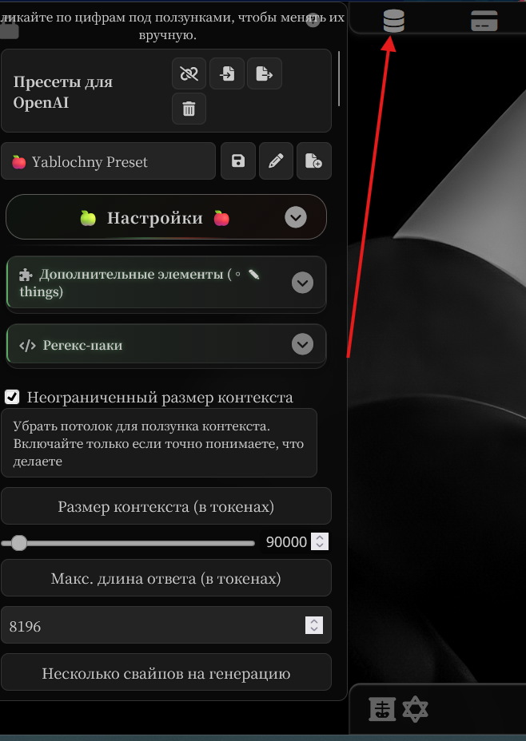
  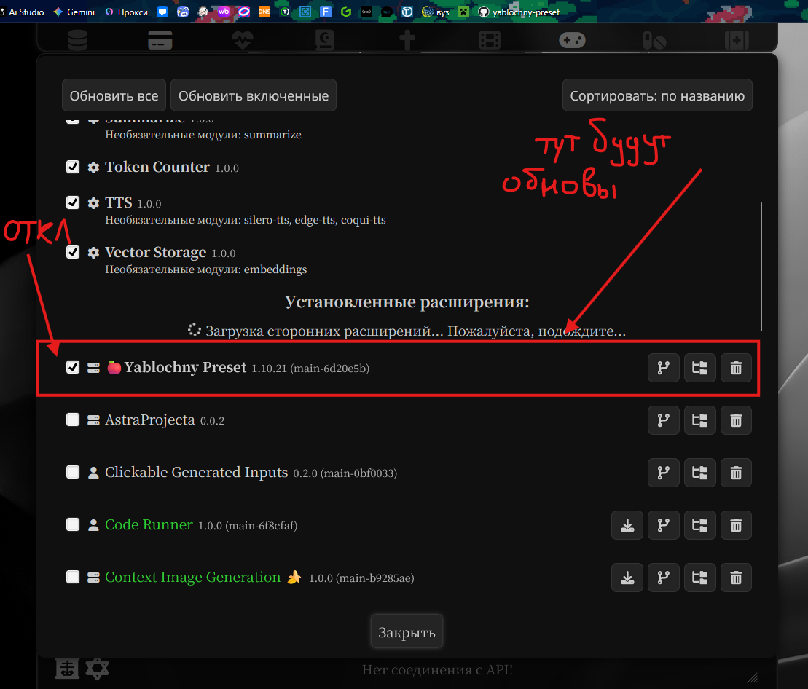

### 3. Настройка вкладки форматирования размышлений
1. Перейдите во вкладку **"A"** (AI Response Formatting).
2. Пролистайте вниз и включите **Auto-Parse**
3. Ещё чуть ниже откройте **"Reasoning Formatting"** и проставьте префикс **`<think>`** и суффикс **`</think>`**
4. Чуть ниже если играете на гемке/клоде (не 4.6 опус/соннете, там надо убрать, на гпт тоже убрать) напишите в **"Start Reply With"** **`<think>`**

  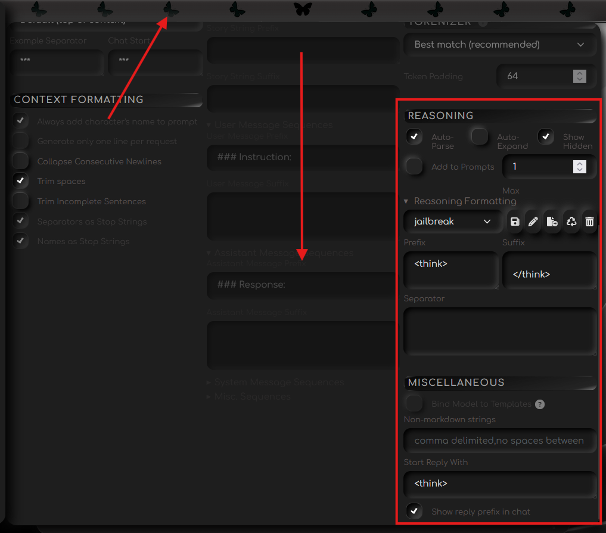

на гпт
 
↓︎

  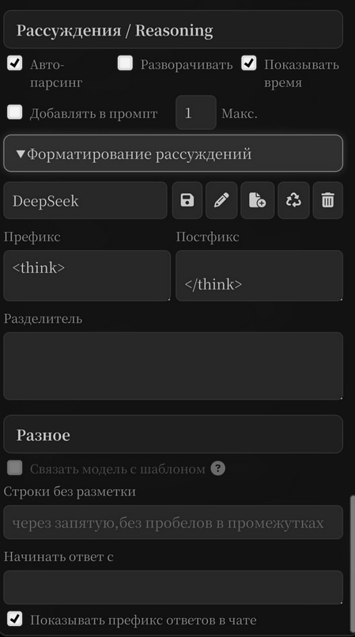

### 4. Постобработка
Рекомендую, если вы используете гемини или клод, поставить постобработку промпта в настройках подключения.

1. Перейдите во вкладку подключения API и прямо над кнопкой подключиться будет эта строка.
2. Выберите semi-strict или strict (no tools обычно, но вроде разницы нет). Я обычно использую semi-strict.

*По опыту: меньше шизы, вероятность багов с тем что модель за юзера пишет и тд снижаются, плюс модель лучше слушается.*

  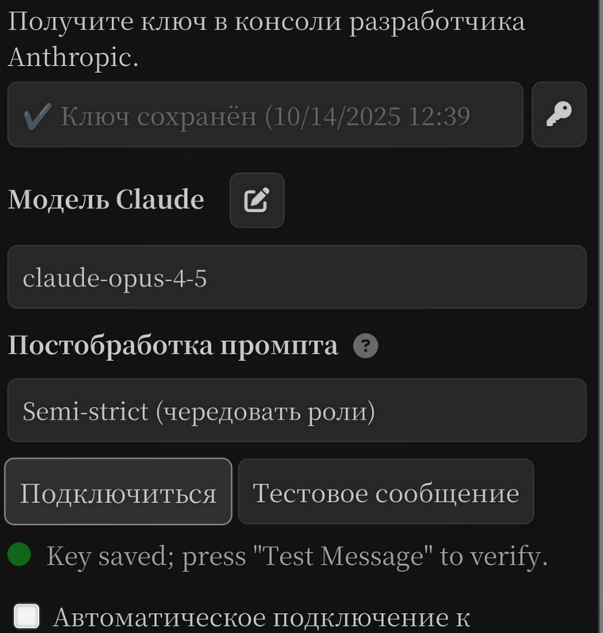
  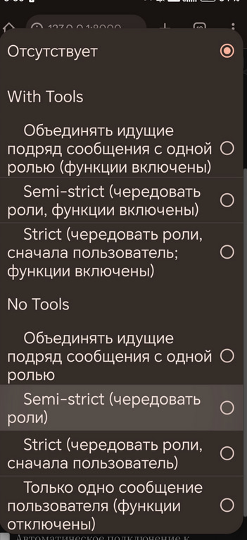

---

## 🌱 Гайд по расширению

### 🌑 Моды
- **Кнопка "Disable Mods (Bypass Settings)"** — Выключение, моды никак не влиют.
- **Claude** — Настройки (температура, префил и тд) для клода
- **Gemini** — Тоже самое только для гемки, включаются нужные для гемки тоглы (double quotes, например), выключается стриминг если был включен ну и настройки температуры, топ П и тд.
- **GPT -COT** — Все настройки для гпт БЕЗ думалки, джейлбрейк и тд. Не забудьте стереть всё в **"Start Reply With"**.
- **GPT +COT** — Все настройки для гпт С думалкой, джейлбрейк и тд. Не забудьте стереть всё в **"Start Reply With"**.
- **DS -COT** и - **DS +COT** аналогично, но с дипсиком всё равно тяжело, работают далеко не все.

*Для GLM юзайте мод клода. Для 4.6 опуса/соннета сотрите **"Start Reply With"**, включите мод клода, тыкните **"Disable Mods (Bypass Settings)"**, опуститесь вниз пресета, выключите **"◈︎ ↗ universal prefill"** и сохраните пресет как обычно. Новый опус/соннет не поддерживает префиллы.*

  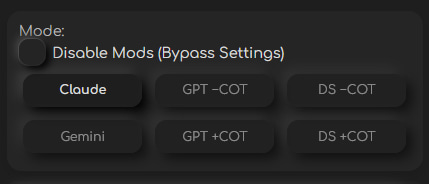

### 🌻 Синхронизация пресета
> Зачем?

Чтобы обновить все важные промпты и тоглы (просто/после обновления). То есть подтягивание их к "дефолтным".

**ТОЛЬКО К ВАЖНЫМ**: те, которые вы сами создали/просто настройки не затронутся. Если вышла обнова пресета вы обновляете расширение, перезагружаете страницу и синкуете вручную/оно синкуется само если включено **"Sync on start"**.

Dev мод не трогайте, не советую, оно только для меня и недоделано.

  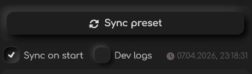

### 🪷 Разделы в "Настройках"
Тут находятся все варианты тоглов. Мне кажется даже без гайда вполне понятно как это работает, просто промпты заменяются на другие в зависимости от выбранного варианта.

*При ЗАЖАТИИ на саму кнопку варианта вас перенесёт к привязанному к настройке тоглу и подсветит его. Так же и наоборот (ну почти): тоглы с вариантами окрашены в зелёный и у них есть доп кнопочка, при нажатии на неё вас перенесёт к привязанной настройке. Это работает и с окрашенным в золотой тоглам, но они переносят к привязанным регексам и от регексов к тоглам.*

  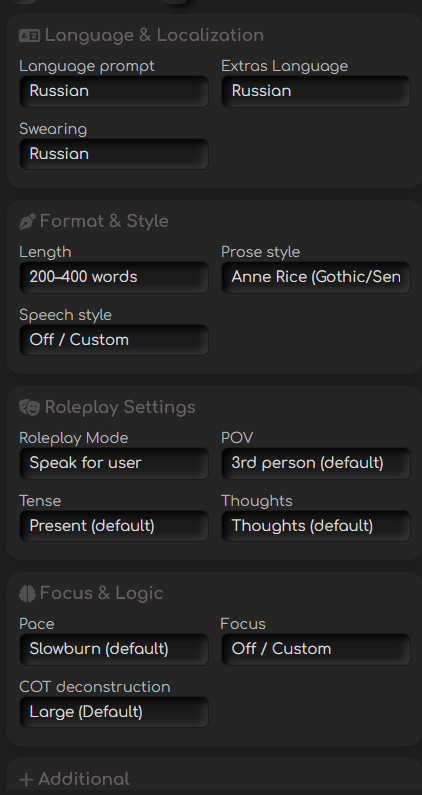

### 🥪 Дополнительные элементы
Много доп штук из старых версий, пихает всё выбранное в "things" тогл.

Юзать ПОКА не особо советую тк промпты там устарели, но мб надо кому-то. В дальнейшей вкладку подпеределаю чтоб там вся возня лежала, но пока так.

*При зажатии на сам раздел перекинет на тогл сам, его надо включить и сохранить пресет для работы. В самом тогле можно ещё своих штук напихать они вроде норм с друг другом должны сосуществовать (если я опять ниче не сломала)*

  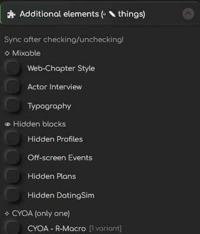

### 🥄 Регекс паки
Моё прошлое расширение, но теперь оно вот тут. Работает так же как и на 1.9 (разве что дебаг хуй там просто так, да и хуй с ним).

Если включаете тогл, привязанный к регексу (они окрашены в золотой) этот регекс надо включить. У некоторых тоглов есть варианты для пк/мобилки, выберите нужный.

  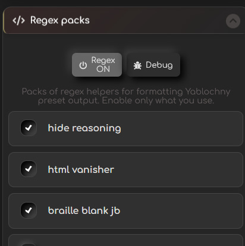

---

## 🧩 Гайд по тоглам (Значки)

| Значок | Значение |
| :--- | :--- |
| ◈︎ | **Обязательный**. Отключать НЕЛЬЗЯ (иначе всё сломается). |
| ↗ / ↘︎ / →︎ | **Выбор**. Выбирать только **один** из списка. |
| ┌︎ | **Зависимость сверху**. Работает только если включен верхний тогл. |
| └︎ | **Зависимость снизу**. Относится к нижнему блоку. |
| ◦︎ | **Опционально**. Включайте по желанию. |
| 🍏 / 🍎 | **Перемычка**. Выключать НЕЛЬЗЯ. Цвета яблок чередуются (🍏/🍎 или 🍎/🍏). |

---

## ⚙️ Подробное описание настроек

### 🧱 Основное
- **◈︎ setvars** — Не выключать. Просто не выключать.
- **◦︎ GPT JB** — Включайте только если используете GPT (оно подтягивается само с модов на гпт).
- **◈︎ core** — Сердце пресета. НЕ трогать и ничего НЕ менять.
- **🍏 ◜base◞︎ 🍎** — Перемычка. Не выключать.
- **◈︎ language** — Язык ролевой, выбирается в расширении.
- **◈︎ length** — Длина ответа, в расширении варианты.
- **◈︎ roleplay mode** — говори/не говори за юзера, выбирается в расширении.

### ✍️ Стиль (Scribbling)
**🍎 ◜scribbling◞︎ 🍏**
- **┌︎ ◦︎ JB (Braille Blank)** — Заменяет обычные пробелы на невидимые символы Брайля. Обход цензуры. *Используйте вместе с регексом `braile black JB`.*
- **┌︎ ◈︎ pov** — От какого лица (1/3), выбирается в расширении.
- **┌︎ ◈︎ tense** — В каком времени (наст/прош/будущ) ведется ролка, выбирается в расширении.
- **┌︎ ◈︎ thoughts** — Мысли в формате `*думает*`. В расширении есть вариант где их побольше и где нет вообще.
- **┌︎ ◦︎ drawn-out narrative** — "Тянучка". Заставляет ИИ растягивать сцену и не заканчивать каждый пост уходом в закат или сном.
- **┌︎ ◦︎ less descriptions** — Меньше воды и описаний природы.
- **┌︎ ◦︎ real world grounding** — Приземление. Добавляет в мир реальные бренды, места и события для реализма.
- **┌︎ ◈︎ focus** — Фокус на диалогах/деталях. В расширении есть выкл вариант, он по дефолту стоит.
- **┌︎ ◈︎ swearing** — Мат. По дефолту в расширении варик "выкл" можно выбрать маты на ру/укр, на английском модель сама разберётся.
- **◈︎ writing rules** — Сюда относятся все верхние дополнения + все основные правила.
- **┌︎ ◦︎ speech style** — Стиль речи персонажей. *Осторожно:* иногда конфликтует с основным стилем ("автором прозы"). По дефолту выбран пустой вариант, в расширении можно выбрать какой хочц.
- **◈︎ prose style** — Стиль автора (как пишет ИИ). По дефолту стоит стиль фанфиков с AO3, остальные в расширении.
    - *Если меняете на свой:* включите в расширении варианты Custom и не удалите случайно `{{getvar::speech_author}}` и `{{setvar::prose_check...}}`.

### 🎭 Динамика (Branches)
**🍏 ◜branches◞︎ 🍎**
- **◈︎ pace** — Темп ролевой, выбрать в расширении.
- **┌︎ ◦︎ REG** — Random Event Generator. ИИ сам подкидывает случайные события и конфликты в мир.
- **┌︎ ◦︎ speech enhance** — "Живая" речь. Протяжные слова («нееет»), запинки («я-я не…»), капс при крике, учет настроения в голосе.
- **┌︎ ◦︎ scene momentum** — Динамика сцены. Запрещает ИИ стоять на месте и делать ленивые таймскипы («на следующий день»).
- **┌︎ ◦︎ char autonomy** — Характер. Персонаж имеет свое мнение, может отказать, игнорить, быть занятым «за кадром».
- **┌︎ ◦︎ npc autonomy** — Каждый NPC — личность со своим мнением, а не просто картон.
- **┌︎ ◦︎ real world grounding** — Упоминает реальные места, улицы, брэнды и тд. Если ролите всякое фэнтези не включайте.
- **◦︎ enhances** — Сюда автоматически собираются все включенные выше улучшалки.

### 🩹 Патчи (Patches)
**🍎 ◜patches◞︎ 🍏**
- **◦︎ double quotes** — Чтобы Gemini не ломала диалоги и писала их в «кавычках» (обязательно для неё).
- **◦︎ user silent turn** — Чтобы ИИ не ныл "твой ход пустой...", если вы просто нажали Enter.
- **┌︎ ◦︎ banwords** — Банворды. *Иногда ломают больше, чем чинят.*
- **┌︎ ◦︎ anti-loop** — Против повторений и предсказуемости.
- **┌︎ ◦︎ no drama** — Анти-драма.
- **┌︎ ◦︎ anti-pronouns** — Меньше "он/она/я".
- **┌︎ ◦︎ ↗ anti-echo** — Запрещает ИИ повторять слова юзера. (Для всех кроме GPT).
- **┌︎ ◦︎ ↘︎ GPT anti-echo** — То же самое, но специально для GPT.
- **◈︎ banned** — Технический тогл, запрещает читать мысли персонажей и писать диалоги через тире. Сюда собираются патчи.

### 🔞 NSFW
**🍎 ◜nsfw◞︎ 🍏**
- **◦︎ porn mode** — Тогл из сельки на порнуху, прям порнуху...
- **◦︎ GPT sex scenes** — Улучшенное описание секса для GPT. *На других моделях может ломать логику (т.к. отправляется после истории), но если секс сухой — пробуйте.*
- **┌︎ ◦︎ dirty talk** — Вульгарные словечки.
- **┌︎ ◦︎ vocalization** — Стоны и звуки.
- **┌︎ ◦︎ violence** — Кровь, кишки, травмы.
- **┌︎ ◦︎ no horny (Rogati)** — "Анти-стояк". Персонажи не возбуждаются от каждого чиха. Для чистого флаффа.
- **◦︎ instructions** — Сюда собираются инструкции для интима + база.

### 🎨 Оформление (Tweaks & Things)
**🍏 ◜tweaks◞︎ 🍎**
- **◦︎ colored dialogues** — Цветные диалоги. Каждому персонажу свой цвет. *Лучше прописать цвета в Author's Note, чтобы ИИ не забыл их после очистки контекста.*
- **◦︎ colored emphasis** — Выделяет цветом ключевые слова.
- **┌︎ ◦︎ comments** — Комментарии Ренетт под постами.
- **◦︎ renette ooc** — Сама Ренетт (OOC-персонаж), с которой можно поболтать через `(ООС:...)`.

⚠️ **Внимание:** Штучки дрючки жрут токены! Не включайте всё сразу, качество текста может упасть. В штуках сейчас лежит куча неоптимизированных приколов из старых версий.
- **◦︎ ✎ things (sample)** — Сюда можно вставить свой кастомный HTML-промпт можно + навыбирать в расширении во второй вкладке.

**Генерация картинок (Image Gen):**
- **┌︎ ◈︎ image style** — Стиль картинок, можно выбрать из вариантов в расширении или поставить там "свой" и написать в тогле свой вариант.
- **◦︎ image generation** — Нужно включить этот тогл, если хотите картинки в принципе (в телефоне допустим).
- **└︎ ◦︎ addon** — Включаете если хотите поюзать комиксы/новел штуки и тд (их варианты есть в расширении). Выберите вариант "свой" в расширении и напишите свой варик если хотите.

> **Важно:** Для работы оформления нужно включить соответствующие регексы в расширении!
**◦︎ regex-parsed** — Запрещает ИИ выдумывать свой HTML. Включите, если используете тоглы ниже.

- **├ ◦︎ ↗ clocks** — Полные часы (Дата, место, время, погода, одежда, сцена). В начале поста.
- **├ ◦︎ ↘︎ clocks minimal** — Мини-часы (Только дата, место, время, погода).
- **└︎ ◦︎ phone** — Телефон/соцсети. Появляется *только* если в сюжете есть телефон.
- **└︎ ◦︎ diary** — Дневник. Появляется *только* в конце дня, когда чар пишет записи.
- **└︎ ◦︎ transitions** — Вставки: воспоминания, ощущения, факты, мечты (2-3 раза за пост).
- **└︎ ◦︎ music player** — Плеер с треком. Иногда ИИ путает название и текст песни :)
- **└︎ ◦︎ infoblock** — Инфоблок (как часы + мысли + настроение + отношения).
- **└︎ ◦︎ psycholgical portraits** — Психологический портрет (темперамент, конфликты и т.д.).

- **└︎ ◈︎ extras lang** — Перевод всех доп штучек из этого раздела.

### 📚 Лор и Память
**◈︎ ╮︎ ゛ˎˊ˗ •** — Перемычка.
- **┌︎ ◦︎ world (before)** — Лорбук (часть 1).
- **◈︎ cards** — Информация из карточек персонажей. Не выключать.
- **└︎ ◦︎ world (after)** — Лорбук (часть 2).
- **◦︎ enhance definitions** — Ищет доп. инфу, которую знает модель. С рабочим поиском вообще сказка.
- **◦︎ chat examples** — Примеры диалогов из карточки.
- **◈︎ ✂︎ - ゛ˎˊ˗ •** — Перемычка.
- **◦︎ summary** — Включать ТОЛЬКО если есть саммари (в настройках ST поставьте "Insert Summary" в "None/Not Injected").
- **◈︎ ╮︎**
- **◈︎ ╯︎** — Перемычки для последнего хода юзера.
- **◈︎ ╯︎ - ゛ˎˊ˗ •**

---

## 🥀 Шпаргалка для тех кто хочет вырубить
Выключите расширение в управлении расширений, да и всё...
